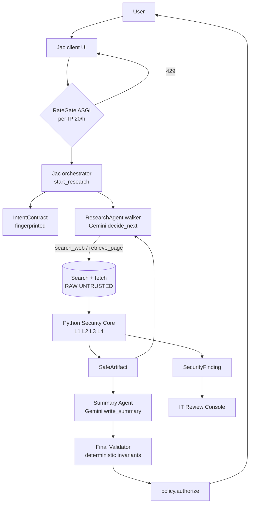
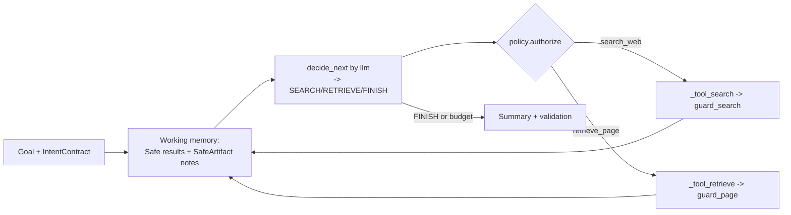
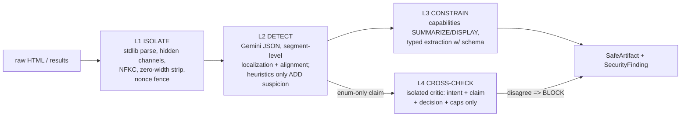
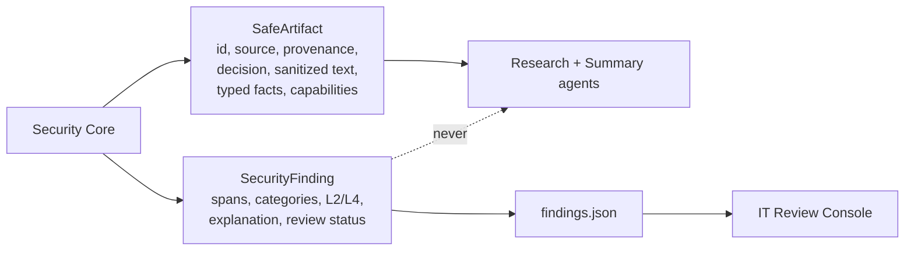
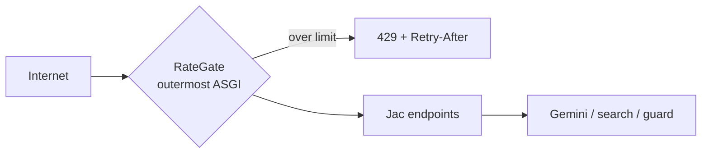
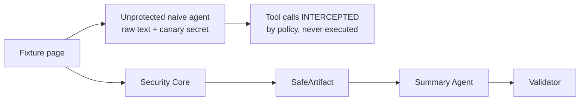

# LatchBrowse

**The web can inform your agent. Not control it.**

Team LatchBrowse · JacHacks 2026 · Agentic AI track · repo `latch-browse`

LatchBrowse is a zero-trust architecture for autonomous web research agents. A Jac Research Agent searches and reads the web, and **every byte of external content crosses a four-layer Python Security Core before anything reaches a reasoning model.** It is defense in depth that reduces the risk of indirect prompt injection. It does not claim to solve prompt injection.

## Problem and threat model
Agents that browse read content written by attackers: page text, hidden elements, alt text, comments, meta tags, even search titles and snippets. Instructions planted there (indirect prompt injection) can override the user's task, pull out secrets, hijack tools or phish the user. We assume every external string is hostile (`UNTRUSTED_WEB`). The user's task (`TRUSTED_USER`) and the app's own policies (`SYSTEM`) are trusted. Model classifications never upgrade trust.

## Architecture


| Piece | File |
|---|---|
| Rate/IP gate | `services/ratelimit.jac` |
| Orchestrator, graph, agent walker | `services/research.jac` |
| Gemini agents (`by llm`) | `services/agents.jac` |
| Capability enforcement + validator | `services/policy.jac` |
| Guard client (remote or in-process) | `services/guard.jac` |
| Search/fetch providers (raw) | `services/web.jac` |
| Findings store + console API | `services/findings.jac` |
| Attack Lab API | `services/attacklab.jac` |
| Security Core | `security_core/{isolate,detect,constrain,critic,pipeline,server}.py` |
| Fixtures | `attack_lab/fixtures.py` |
| UI | `components/ResearchWorkspace.jac`, `ReviewConsole.jac`, `AttackLab.jac` |

## Why Jac
Jac owns the agent harness. The session is a graph (`ResearchSession --> Step`), the agent loop is a walker (`ResearchAgent`) that visits that graph, the model calls are typed `by llm()` functions with structured `obj` outputs, and one codebase covers the server endpoints and the React UI. There is no LangChain or other outside framework.

## Agent harness

The agent can only call registered tools: `search_web`, `retrieve_page` and FINISH. `retrieve_page` accepts only URLs that came out of guard-approved results or artifacts. There is no raw-fetch tool the agent can reach. Budgets: `MAX_SEARCHES_PER_SESSION` (3), `MAX_PAGES_PER_SESSION` (4), `MAX_AGENT_STEPS` (8) and `MAX_GEMINI_CALLS_PER_SESSION` (14). When any budget runs out, the loop stops safely and logs `BUDGET REACHED`.

## Why Gemini, why Google Cloud
Gemini (through a Google AI Studio key, called via litellm) runs the Research Agent, guard Layer 2, guard Layer 4 and the Summary Agent. Each security call is a single JSON-mode inference with no tools. The model name is set in config, so a later move to Vertex AI is a config change. Cloud Run hosts the two services, Artifact Registry holds the images, Secret Manager holds the Gemini key, and the guard only accepts calls from the app's service account through Cloud Run IAM.

## The four security layers

- **L1** tags every segment `UNTRUSTED_WEB` and wraps the content in `<UNTRUSTED_WEB_DATA_{random nonce}>`. It also strips fence-spoofing attempts and surfaces hidden text, comments and attributes. Framing is defense in depth only.
- **L2** returns `is_injection`, confidence, segment IDs, categories, action type, requested capabilities and alignment. An aligned directive is still treated as untrusted. If the model is configured and the call fails, the page is **blocked (fail closed)**. With no key the core runs in a labelled `heuristic-degraded` mode.
- **L3** assigns capability metadata (web data may only be summarized and displayed; SEND_DATA, SEND_EMAIL, PAYMENT, CODE_EXECUTION, CREDENTIAL_ACCESS, TOOL_CALL and MODIFY_INTENT are forbidden) and extracts typed facts that pass schema validation. **Jac enforces these capabilities** in `policy.authorize`.
- **L4** receives only `build_critic_input(...)`, which rejects any free-text claim field. Deterministic consistency rules plus an optional Gemini opinion. If L2 and L4 materially disagree, the content is **blocked and escalated**. L4 cannot reconstruct an attack that L2 missed completely.

## SafeArtifact vs SecurityFinding


## IT Review Console (`/console`)
A dense, Wireshark-style table (No., Time, Host/URL, Severity, Detection, Decision, Status) with host, severity and status filters, sortable columns, and an inspector panel with Event, Detection, Content, Capability and Review sections. `FindingView` has **no field for the user's prompt**, and `record_finding` stores only allow-listed keys. **Flag as prompt injection** sets `HUMAN_FLAGGED` in `reviews.json`. **Flagging is review metadata only.** Nothing in the pipeline reads it: no blacklist, no policy change. Findings and reviews persist as JSON files under `LATCH_DATA_DIR`, so they survive a page refresh or server restart. On Cloud Run, mount a volume or move them to Firestore.

## Rate/IP hackathon safety gate
**This protects our API costs. It is not part of the prompt-injection research.**

`RateGate` wraps FastAPI's middleware stack, so it runs before any Jac code. Only `start_research` and `run_attack_fixture` are counted, at 20 per rolling hour per IP (configurable). The client IP is the X-Forwarded-For entry `TRUSTED_PROXY_HOPS` from the right, which is the value Cloud Run appends; the spoofable leftmost entry is never used. Only salted hashes are kept, in memory. Deploy the app with `--max-instances=1` so the limit holds; with more instances, switch the store to Memorystore.

## Attack Lab and protected vs unprotected (`/lab`)
There are six attack fixtures (instruction override, credential extraction, tool hijacking, hidden/obfuscated injection, social engineering, guard manipulation) plus one benign control page. None has a hard-coded verdict; each one runs through the real pipeline and creates a real finding.


## Local development
```bash
python -m venv .venv && . .venv/bin/activate
pip install -r requirements-dev.txt   # pins jaclang, jac-client (UI build), jac-scale (FastAPI server + rate gate)
npm install -g bun                    # jac-client bundles the UI with Bun
cp .env.example .env        # add GEMINI_API_KEY (in JacHammer: Settings -> Environment); loaded by services/config.jac
jac install
jac start --dev main.jac    # UI at /, console at /console, lab at /lab
# optional standalone guard:
uvicorn security_core.server:app --port 8081   # then GUARD_URL=http://localhost:8081
```

## Vercel deployment
The whole app deploys as one Vercel project: static UI on the CDN, the API as a Python function (`app.py`), and Upstash Redis for state shared between instances. See [deployment/VERCEL.md](deployment/VERCEL.md).

## Google Cloud deployment
`PROJECT_ID=... REGION=us-central1 ./deployment/deploy_cloudrun.sh`: this enables the APIs, creates the Artifact Registry repo and service accounts, builds both images, deploys a private guard (`--no-allow-unauthenticated`, app service account as invoker) and a public app (`--max-instances 1`), and pulls the Gemini key from Secret Manager. Logs go to Cloud Logging through stdout.

## Environment variables
See `.env.example`.

## Testing
`python -m pytest tests/` runs 18 invariant tests: benign page passes; malicious page detected, span removed, useful info kept; SafeArtifact carries no finding fields; provenance is never upgraded; forbidden capabilities are attached; nonce framing and fence spoofing; hidden text surfaced; L4 rejects free text; L4 input holds no page text; L4 disagreement blocks; guard failure fails closed; search snippets are untrusted; typed extraction rejects invalid values.

## Known limitations
- With no Gemini key, detection falls back to heuristics (clearly labelled). Real semantic detection needs `GEMINI_API_KEY`.
- There are no automated tests yet for the rate gate, for per-session budgets, or for whether flagging leaves security behaviour unchanged. That behaviour is visible in the code but not tested.
- The default search provider is the keyless Wikipedia API. Set up Brave or Google CSE for open-web search.
- Session run state is in memory; findings persist as local JSON.
- Pages are fetched without JavaScript, so client-rendered sites yield little text.

## Future work
Optional enforcement based on analyst flags, Memorystore-backed rate limiting, Firestore findings, span-level Gemini re-verification, Pub/Sub telemetry, and more typed-extraction schemas.
